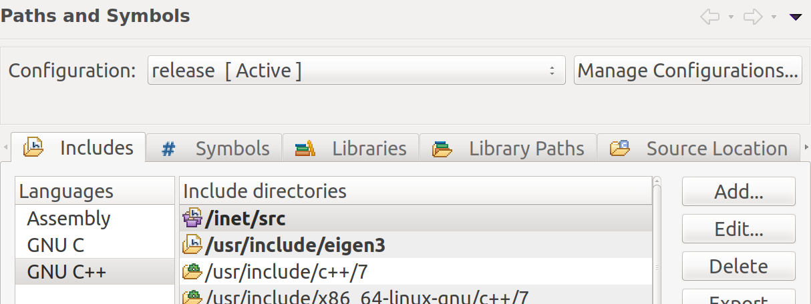

# Street-level Simulator for SCENTS(collaborative sensing in proximity IoT networks)
[](LICENSE)

## Getting Started

### Prerequisites
- [OMNeT++ v5.4.1](https://omnetpp.org/download/)

- [INeT Framework v4.0](https://github.com/inet-framework/inet)

- [Eigen3](http://eigen.tuxfamily.org) C++ template library for linear algebra.

- Include the 3rd party libraries in project path (shown in below fig)


### Experiment Scenarios

Config: `simulations/env_austin/omnetpp.ini`
Run Script: `simulations/env_austin/run.sh`

### Customize the simulation

You can download the data of your target geographical region in OSM
format and convert the buildings using the osm parser
script. Waypoints used in the mobility model are also GPS
coordinates. Other things are mostly configurable through
`omnetpp.ini`.

## Screenshots


[(YouTube vid)](https://youtu.be/KPqtK9t2efs)


## License and Citation
This simulator is released under the BSD 3-Clause license.

Please use the following reference in your publications if this project helps your research:
```
@inproceedings{liu2019scents,
  title={SCENTS: Collaborative Sensing in Proximity IoT Networks},
  author={Liu, Chenguang and Hua, Jie and Julien, Christine},
  booktitle={Proceedings of the 17th IEEE International Conference on Pervasive Computing and Communications Workshops (PerCom Workshops)},
  year={2019},
  organization={IEEE},
}
```
